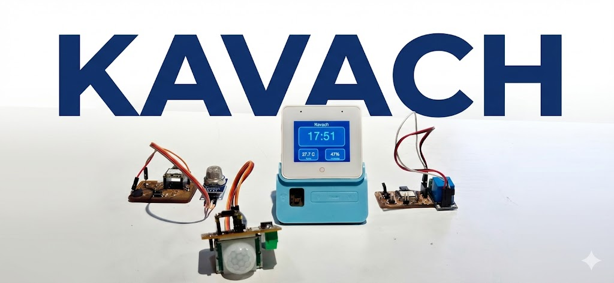
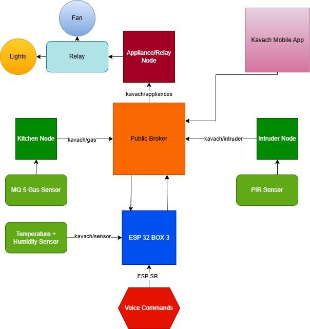
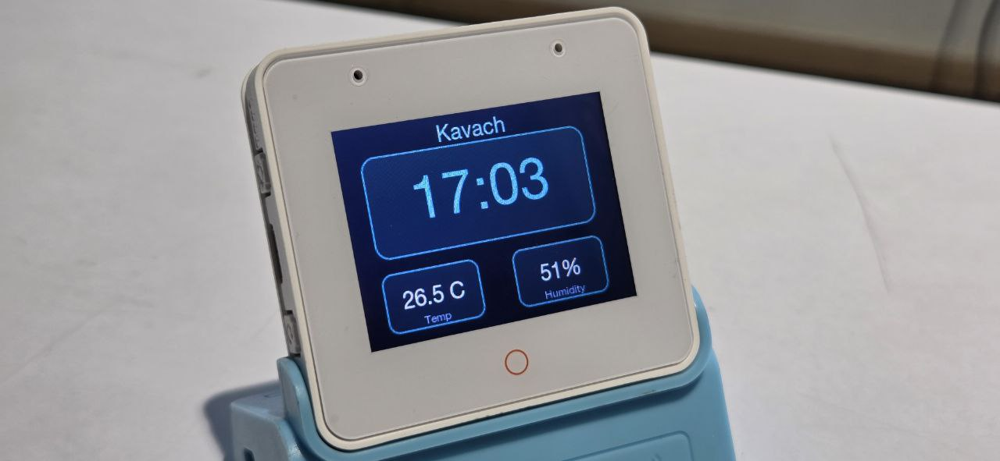
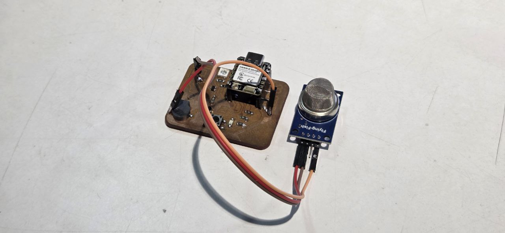
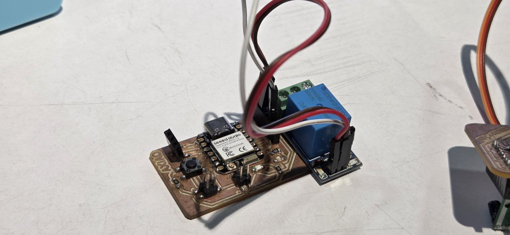
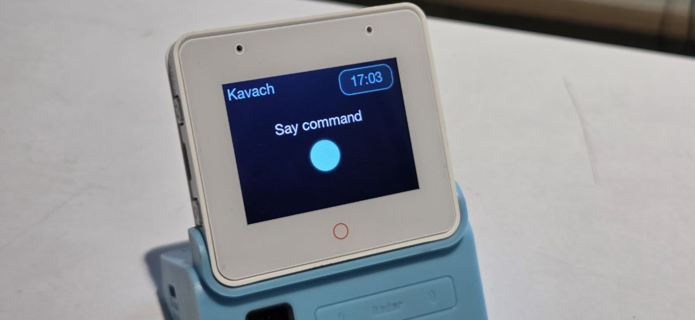
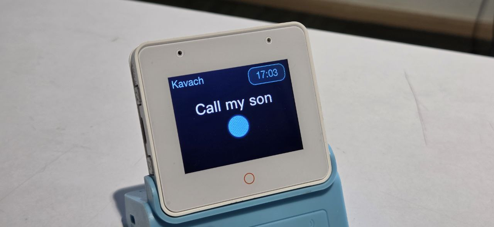

# Kavach – Smart Home Device for Elders



**Kavach** is an elderly-focused AI assist device for **ESP32-S3 Box**: offline **voice recognition**, a **minimal UI**, and **MQTT** integration. The device publishes voice commands to an MQTT broker so your app can notify emergency contacts or control IoT appliances. The ecosystem includes the **Kavach voice device**, **gas sensor node**, **relay control node**, **PIR (intruder) sensor node**, and a **Flutter mobile app**—all connected through the same MQTT broker.

---

## System overview



*Block diagram: all components connect to a central **Public Broker** (MQTT). The **ESP32 BOX 3** takes voice input and temperature/humidity, and exchanges messages with the broker. **Appliance/Relay**, **Kitchen (gas)**, and **Intruder (PIR)** nodes subscribe or publish on their topics; the **Kavach Mobile App** monitors and controls the system.*

---

## System architecture (how it fits together)

- **Public Broker (MQTT)** – Central hub. Every device and the app connect here; they publish and subscribe to topics instead of talking to each other directly.
- **ESP32 BOX 3 (Kavach voice device)** – Runs **ESP-SR** for wake word and speech commands. It **publishes** voice outcomes to `kavach/help` and `kavach/appliances`, and **subscribes** to `fabacademy/kavach/gas` and `fabacademy/kavach/intruder` to show gas/intruder alerts. It also reads an onboard (or dock) **temperature + humidity** sensor and publishes to `kavach/sensor`.
- **Appliance/Relay node** – Subscribes to `kavach/appliances`. When it receives a command (from voice or app), it drives a **relay** to control **lights**, **fan**, or other loads. IR learning (for AC) is done on the ESP32 BOX 3; relay node only does on/off.
- **Kitchen node** – Connects an **MQ-x gas sensor**; when gas exceeds a threshold it **publishes** to `kavach/gas`. The Kavach device subscribes and shows a gas-leak alert and plays the alarm WAV.
- **Intruder node** – Connects a **PIR** (motion) sensor; on motion it **publishes** to `kavach/intruder`. The Kavach device subscribes and shows an intruder/motion alert.
- **Kavach Mobile App** – Subscribes to `kavach/help` and `kavach/appliances` (and optionally sensor/gas/intruder). It can send commands (e.g. turn light on) and optionally **ping** the device (`fabacademy/kavach/ping` → device replies on `pong`) to check if it is online.

**End-to-end flow:** User says “Alexa” (or “Hi ESP”) → device wakes and beeps → user says “Turn on the light” → ESP-SR recognises the command → device publishes to `kavach/appliances` → **relay node** subscribes and turns the light on; the **app** can show the same. For safety: **gas node** publishes to `kavach/gas` on leak → Kavach device shows full-screen alert and plays `gas_alarm.wav`; **PIR node** publishes to `kavach/intruder` on motion → device shows intruder alert. Temperature/humidity from the box are published to `kavach/sensor` on a timer for the app or dashboards.

---

## Features




| Feature | Description |
|--------|-------------|
| **ESP-SR** | Offline wake word (“Alexa”) and command recognition. |
| **Minimal UI** | Single screen: title “Kavach”, status text, and on-screen state (idle / listening / command ok / alert). Optional clock display. |
| **WiFi** | STA mode using SSID and password from menuconfig or `sdkconfig.defaults` (no provisioning UI). |
| **MQTT** | Publish-only client: help/alert commands → `kavach/help`; appliance commands → `kavach/appliances`. Your backend subscribes and acts (e.g. call family, control lights). |
| **IR learning** | Long-press home button to learn AC remote; voice commands then control AC via IR. |
| **Emergency** | Short-press home button sends an emergency message to the help topic. |

---


---

## MQTT setup


1. **Broker** – Run Mosquitto (or any MQTT broker) on your PC or server on the same LAN.
2. **Configuration** – Set WiFi and broker in menuconfig or in `examples/kavach_demo/sdkconfig.defaults`:
   - **Menuconfig:** from `examples/kavach_demo`, run `idf.py menuconfig` → **Kavach Configuration**:
     - **WiFi SSID** / **WiFi Password**
     - **MQTT Broker URI** (e.g. `mqtt://192.168.1.100:1883`)
   - **Or edit** `examples/kavach_demo/sdkconfig.defaults`:  
     `CONFIG_KAVACH_WIFI_SSID`, `CONFIG_KAVACH_WIFI_PASSWORD`, `CONFIG_KAVACH_MQTT_BROKER_URI`.
3. **Topics (publish only)** – The device only publishes; your app subscribes and reacts:

| Topic (configurable) | When used | Example payload | Use in your app |
|----------------------|-----------|------------------|------------------|
| **`kavach/help`** | Help / alert / call family / “Help” | `I need help`, `Send alert`, `Emergency - home button` | Notify emergency contacts, trigger calls |
| **`kavach/appliances`** | Other voice commands (light, play, AC, etc.) | `Turn on the light`, `Turn off the Air` | Forward to IoT / smart home |
| **`fabacademy/kavach/sensor`** | Optional temperature/humidity | JSON with sensor data | Monitoring (if sensor enabled) |

---

## MQTT ecosystem: nodes and app

All devices use the **same MQTT broker**. The Kavach voice device publishes and subscribes; the nodes and Flutter app complete the loop.


| Node / app | Role | Topics (see below) |
|------------|------|--------------------|
| **Kavach voice device** | Voice → MQTT; alerts from gas/PIR | Publishes: `help`, `appliances`, `sensor`. Subscribes: `gas`, `intruder`, `ping` (replies `pong`). |
| **Gas sensor node** | Reads gas sensor; on leak → publish | Publishes: `fabacademy/kavach/gas` (payload with `"state":"LEAK"`). |
| **Relay control node** | Subscribes to appliance commands → drives relays | Subscribes: `kavach/appliances` (or `fabacademy/kavach/appliances`). Controls lights, fan, etc. |
| **PIR / intruder sensor node** | Motion detected → publish | Publishes: `fabacademy/kavach/intruder` (e.g. `{"device":"pir_sensor","motion":"detected"}`). |
| **Flutter app** | Alerts, appliance UI, optional ping | Subscribes: `kavach/help`, `kavach/appliances`. Can publish `fabacademy/kavach/ping` to check device online. |






Example firmware for **gas**, **relay**, and **PIR** nodes is in **`mqtt_nodes/`** (see [mqtt_nodes/README.md](mqtt_nodes/README.md)). The **Flutter app** lives in **`app/`** or is linked from there—see [app/README.md](app/README.md).

---


```

---

## Build and flash

From the repository root:

```bash
cd examples/kavach_demo
idf.py set-target esp32s3
idf.py build
idf.py -p <PORT> flash monitor
```

- Set **Board: ESP32-S3-BOX-3** (or Box Lite) in `idf.py menuconfig` (BSP) if needed.
- The demo uses **`../../components`** as `EXTRA_COMPONENT_DIRS`; ensure the repo is cloned with the `components` directory at the root.

**If MQTT does not connect** (e.g. `esp-tls: select() timeout` / `Error transport connect`):

- Use **plain MQTT**: URI must be `mqtt://<IP>:1883` (not `mqtts://`). The project disables SSL by default in `sdkconfig.defaults`.
- Run the broker on the PC (e.g. `mosquitto -v`), listening on `0.0.0.0:1883`.
- Put the ESP32 and broker on the same LAN; set **MQTT Broker URI** to the PC’s IP (e.g. `mqtt://192.168.220.13:1883`).
- Allow inbound TCP port **1883** on the machine running the broker.
- After changing `sdkconfig.defaults`, run `idf.py fullclean` then `idf.py build`.

---

## Voice commands

Wake the device with **“Hi ESP”** or **“Alexa”** (configurable in **Kavach Configuration**). After the wake beep, say one of the phrases below. The recognised command is published to **`kavach/help`** (help/alert/call) or **`kavach/appliances`** (everything else), and the UI is updated. Voice confirmation WAVs are optional (see `examples/kavach_demo/VOICE_CONFIRMATIONS.md`).




### Help and safety (→ `kavach/help`)



| English |
|--------|
| I need help, Send alert, Emergency | 
| Call family, Call my son, Call home, Call | 
| Help, What can you do | 


### Appliances (→ `kavach/appliances`)


| Category | English examples |
|----------|------------------|------------------|
| **Light** | Turn on the light, Switch on the light, Light on, Light / Turn off the light, Light off |
| **Colour** | Turn Red, Turn Green, Turn Blue, Customize Color | 
| **Music** | Sing a song, Play Music, Next Song, Pause Playing | 
| **AC** | Turn on the Air, Turn off the Air, AC on, AC off, AC | 
| **Fan** | Fan on, Fan off, Fan | 


---

## IR learning (AC control)

The Kavach device can **learn** and **replay** infrared codes for your AC (or other IR devices), so voice commands like “Turn on the Air” / “Turn off the Air” control the real unit.

- **How to enter IR learning:** **Long-press the home button** on the ESP32 BOX 3. The UI shows instructions (e.g. “IR learn: press AC On then AC Off”).
- **What you do:** Point your **AC remote** at the box and press **AC On**, then **AC Off**, when prompted. The device records the IR timings via the BSP IR receiver.
- **Where it’s stored:** Learned codes are saved to **SPIFFS** (`/spiffs/ir_ac_on.cfg`, `ir_ac_off.cfg`) so they persist across reboots.
- **How it’s used:** When you say “Turn on the Air” or “AC on”, the firmware looks up the learned “AC on” code and **sends it via the BSP IR emitter**. “Turn off the Air” / “AC off” uses the “AC off” code. The **relay node** does not do IR; IR is only on the ESP32 BOX 3.

So: **IR learning** = teach the box your AC remote; **voice** = trigger that IR from the box; **relay node** = separate, for on/off loads like lights and fan.

---

## Temperature and humidity sensor

When the ESP32 BOX 3 is used with a **sensor dock** (e.g. ESP32-S3-BOX-3-SENSOR), the BSP provides a **temperature and humidity** reader (e.g. AHT20).

- **Reading:** The firmware calls `bsp_board_get_sensor_handle()->get_humiture(&temp, &hum)` to get current values.
- **UI:** The main screen can show temp/humidity (e.g. in clock or idle view); in “voice mode” this may be hidden so the status line is clearer.
- **MQTT:** A periodic timer publishes to **`kavach/sensor`** (or `fabacademy/kavach/sensor`) in JSON, e.g. `{"temp": 25.3, "hum": 60}`. Interval is set in menuconfig (e.g. 30 seconds). The **Kavach Mobile App** or other subscribers can use this for monitoring.

If no sensor dock is connected, the BSP uses a stub that returns a fixed or error value; publishing may be skipped or show default data.

---

## Radar detection (optional)

On boards with a **radar sensor** (e.g. 2.4 GHz radar on the sensor dock), the BSP exposes **`get_radar_status()`** and related APIs. This can be used for **presence detection** (e.g. someone in the room) without a PIR.

- **In this firmware:** Radar is referenced in **settings** (e.g. `radar_en` in NVS). The main Kavach flow does not currently publish radar state to MQTT; **intruder/motion** alerts are driven by the **PIR node** via `kavach/intruder`.
- **If you want radar on MQTT:** You can add a task that reads `get_radar_status()` and publishes to a topic such as `kavach/radar` or reuses `kavach/intruder` with a payload that indicates the source (e.g. `"device":"radar"`). The mobile app or other nodes can then react to presence the same way as PIR motion.

---

## How ESP-SR works (wake word + commands)

**ESP-SR** (Espressif Speech Recognition) runs **on the ESP32** and does **offline** wake word and command recognition—no cloud needed for basic use.

1. **Audio path:** Microphone → I2S → **AFE (Audio Front End)**. The AFE cleans and normalizes the audio and feeds it to the models.
2. **Wake word (WakeNet):** The AFE runs a **WakeNet** model that listens for “Hi ESP” or “Alexa” (or both). When it detects the wake word, it switches to **command mode** and (optionally) plays a short **beep** from SPIFFS (`beep.wav`).
3. **Command recognition (MultiNet):** After wake-up, audio is fed into a **MultiNet** model. It compares the next few seconds of speech against a **fixed list of phrases** (e.g. “Turn on the light”, “Send alert”). The model returns a **command ID** (and optionally phrase ID and probability).
4. **Command list:** The list is defined in firmware (e.g. `g_default_cmd_info` in `app_sr.c`) with **phoneme** strings for better accuracy. Each entry maps a phrase to an internal command (e.g. `SR_CMD_LIGHT_ON`, `SR_CMD_HELP_ALERT`). Language (English/Chinese) is selected in settings.
5. **Result handling:** The handler task gets the command ID, looks up the phrase string, updates the UI, and **publishes** to MQTT (`kavach/help` or `kavach/appliances`) so the app and relay/gas/intruder nodes can act.

So: **Wake word** → beep → **say command** → **MultiNet** → **command ID** → **MQTT + UI**.

---

## How new commands work

To add or change voice commands and have the rest of the system react:

1. **ESP-SR command list (firmware)**  
   - **Option A – New phrase, existing action:** Add a new row to `g_default_cmd_info` in `examples/kavach_demo/main/app/app_sr.c` with the same `sr_user_cmd_t` (e.g. `SR_CMD_LIGHT_ON`) and the new phrase + phoneme. Rebuild and reflash.  
   - **Option B – New action:** Add a new value to the `sr_user_cmd_t` enum in `app_sr.h`, add phrases in `g_default_cmd_info`, and in `app_sr_handler.c` handle the new command ID (e.g. publish to a new topic or a new payload on `kavach/appliances`).  
   - **Option C – Runtime:** Use `app_sr_add_cmd()` / `app_sr_modify_cmd()` to add or change phrases without changing the default table (e.g. from a settings UI).  
   After any change, the MultiNet command list is updated and the device will recognize the new phrase and emit the same MQTT behaviour as the command type you tied it to.

2. **MQTT message**  
   - Help/alert/call → already go to `kavach/help`.  
   - Anything else (lights, fan, AC, custom) → `kavach/appliances`. You can use a JSON payload (e.g. `{"device":"blinds","action":"open"}`) and have the **relay node** or app parse it.

3. **Node / app logic**  
   - **Relay node:** Subscribe to `kavach/appliances`; if you use JSON, parse `device` and `state` (or `action`) and drive the right relay or IR.  
   - **Flutter app:** Subscribe to the same topics; add a button or automation that **publishes** the same MQTT message so the relay (or Kavach IR) reacts.

4. **Optional – New topic**  
   - For a dedicated action (e.g. blinds), you can define a new topic (e.g. `kavach/blinds`) and have a dedicated node subscribe to it. The voice path stays the same: new command ID in handler → `esp_mqtt_client_publish(..., "kavach/blinds", ...)`.

In short: **add the phrase and command in firmware** → **handler publishes to MQTT** → **nodes/app subscribe and act**.

---

## Flutter app


The Kavach **Flutter app** lets users see help alerts, optional appliance controls, and device status. It subscribes to `kavach/help` and `kavach/appliances` and can publish to `fabacademy/kavach/ping` to check if the Kavach device is online (device replies on `fabacademy/kavach/pong`).


- **In-repo:** App code can live under **`app/`** (e.g. `app/kavach_flutter/`).
- **External repo:** Or keep the app in a separate repository and set the link in **`app/README.md`**.

The github repository for the flutter app is linked here:
[My Backend Project](https://github.com/ashishjoy19/Kavach_App)

See **[app/README.md](app/README.md)** for setup and the link placeholder.

---

## Repository layout

Build and run the **Kavach** application from the `examples/kavach_demo` directory. Example firmware for MQTT nodes lives in **`mqtt_nodes/`**; the mobile app is in **`app/`** (or linked from there).

```
Kavach_ESP32/
├── README.md                 # This file
├── app/                      # Flutter mobile app (or link to external repo)
│   └── README.md             # App setup and link placeholder
├── components/               # Board support (BSP); referenced by the demo
├── docs/                     # Project documentation
│   └── images/               # Placeholder photos (add system_overview.png, etc.)
├── examples/
│   └── kavach_demo/          # ★ Kavach voice device (build from here)
│       ├── CMakeLists.txt
│       ├── README.md
│       ├── sdkconfig.defaults
│       ├── main/
│       ├── spiffs/
│       ├── PROJECT_STRUCTURE.md
│       └── VOICE_CONFIRMATIONS.md
├── mqtt_nodes/               # Example firmware for MQTT nodes
│   ├── README.md             # Nodes overview and topics
│   ├── gas_sensor_node/      # Gas leak → publish to broker
│   ├── relay_control_node/   # Subscribe to appliances → control relays
│   └── pir_sensor_node/      # Motion → publish intruder alert
├── hardware/
└── tools/
```

---

## Project files (Kavach application)

All paths below are relative to **`examples/kavach_demo/`**.

### Entry and configuration

| Path | Purpose |
|------|--------|
| `main/main.c` | App entry: NVS, settings, WiFi, SNTP, MQTT, display, BSP, UI, IR, speech recognition. Home button: short = emergency, long = IR learn. |
| `main/main.h` | Version or build macros. |
| `main/settings.c`, `main/settings.h` | Persistent settings (e.g. language, volume) in NVS. |
| `main/Kconfig.projbuild` | **Kavach Configuration** in menuconfig: WiFi SSID/password, MQTT broker URI, topic names, timezone, wake word. |
| `main/idf_component.yml` | IDF Component Manager deps: esp-sr, led_strip, qrcode, ir_learn, aht20, at581x. |
| `sdkconfig.defaults` | Default Kconfig (target, SPIRAM, SR models, WiFi/MQTT placeholders). |

### Application modules (`main/app/`)

| Path | Purpose |
|------|--------|
| `main/app/app_wifi_simple.c`, `.h` | WiFi STA using SSID/password from config. |
| `main/app/app_mqtt.c`, `.h` | MQTT client: **publish only** to `kavach/help` and `kavach/appliances` (and optional sensor topic). |
| `main/app/app_sr.c`, `.h` | ESP-SR integration: wake word and command list (Kavach + factory-style). |
| `main/app/app_sr_handler.c`, `.h` | SR result handling: updates UI; publishes help → help topic, others → appliances topic; optional WAV confirmations. |
| `main/app/app_sntp.c`, `.h` | SNTP time sync for UI clock. |
| `main/app/app_ir.c`, `.h` | IR learning and AC control (long-press home). |
| `main/app/sensor_stub.c`, `.h` | Stub for sensor/IR-learn enable. |
| `main/app/mute_stub.c`, `.h` | Stub for mute/play flag. |

### UI (`main/gui/`)

| Path | Purpose |
|------|--------|
| `main/gui/ui_kavach.c`, `ui_kavach.h` | Minimal UI: title “Kavach”, status label, on-screen state; `kavach_ui_set_status()`, `kavach_ui_set_light()`. |
| `main/gui/font/` | LVGL fonts: `font_en_12.c`, `font_en_24.c`, `font_en_64.c`, `font_en_bold_36.c`. |
| `main/gui/image/` | Assets (e.g. `kavach_logo.png`). |

### SPIFFS and assets

| Path | Purpose |
|------|--------|
| `spiffs/` | Voice feedback WAVs (e.g. `beep.wav`, `echo_en_ok.wav`) flashed as the `storage` partition. See `spiffs/README.txt` and `VOICE_CONFIRMATIONS.md`. |

## Further reading

- **`examples/kavach_demo/README.md`** – Demo-specific setup and MQTT details.
- **`mqtt_nodes/README.md`** – Gas, relay, and PIR node examples and topic reference.
- **`app/README.md`** – Flutter app location or link.
- **`examples/kavach_demo/PROJECT_STRUCTURE.md`** – Minimal file set and dependencies (ESP-IDF, BSP, Component Manager).
- **`examples/kavach_demo/VOICE_CONFIRMATIONS.md`** – WAV files and per-command voice feedback.
- **`examples/kavach_demo/spiffs/README.txt`** – SPIFFS WAV format and required files.
- [ESP-SR](https://github.com/espressif/esp-sr) – Wake word and speech recognition.
